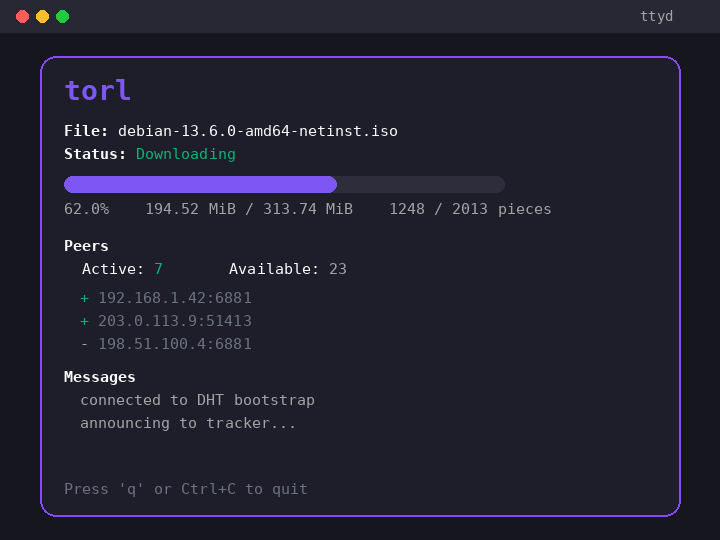
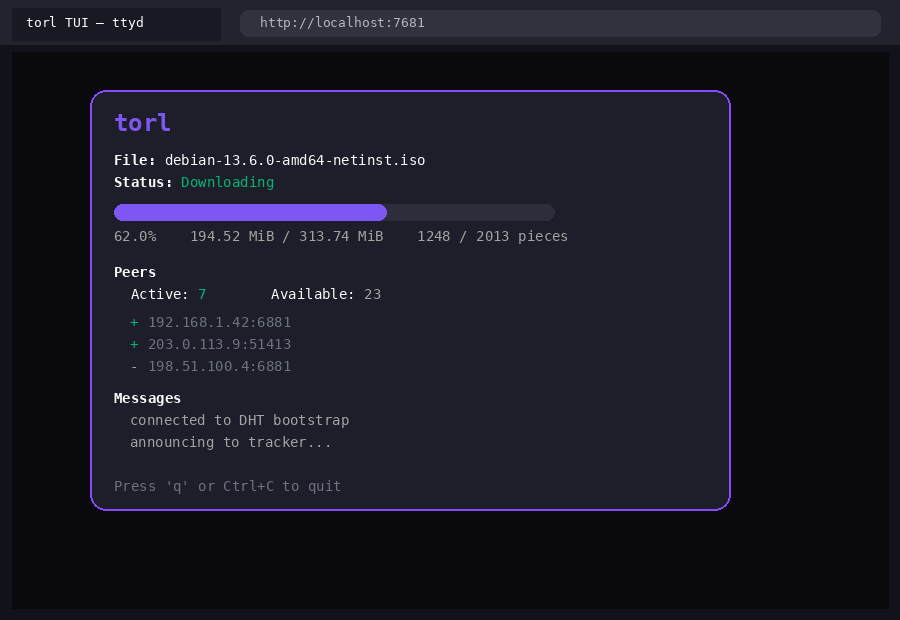

<p align="center">
  
</p>

<h1 align="center">torL</h1>

<p align="center">
  A minimal, dependency-light BitTorrent client for Node.js.
</p>

<p align="center">
  = 20">
  
  
</p>

<p align="center">
  
</p>

## Features

- **Torrent files & magnet links** — download from `.torrent` files or resolve `magnet:` links.
- **Tracker + DHT peer discovery** — supports UDP and HTTP trackers plus BitTorrent Mainline DHT (BEP 5).
- **Rarest-first piece selection** — global `RarityMap` and per-peer queues pick the rarest pieces first.
- **Pause & resume** — a `.torl.state` file stores the completed bitfield; existing data is SHA1-verified on restart.
- **NAT traversal** — automatic UPnP IGD and NAT-PMP port mapping helpers.
- **Metadata exchange** — resolves magnet links via BEP 10 extension protocol + BEP 9 metadata exchange.
- **JSON output** — machine-readable progress events for integration with other tools.
- **Interactive TUI** — optional Go/Bubble Tea TUI (`torl-tui`) with progress, peers, and messages.
- **Fully tested** — mock UDP tracker, TCP peer, DHT node, UPnP/NAT-PMP gateways, and metadata peers.

## Installation

```bash
npm install -g torl
```

Or clone and install locally:

```bash
git clone https://github.com/yourusername/torl.git
cd torl
npm install
```

The optional TUI binary (`torl-tui`) is built automatically during `npm install` if Go is available. If Go is not installed, install it later and run:

```bash
npm run build-tui
```

## CLI Usage

```bash
torl <torrent-file|magnet-link>... [options]
```

### Options

```
  -o, --output <dir>       Output directory (default: current directory)
  -c, --concurrency <n>    Max simultaneous downloads (default: 1)
  -q, --quiet              Suppress progress output
      --json               Emit machine-readable JSON events on stdout
  -h, --help               Show help
  -v, --version            Show version
```

### Examples

Download a single torrent:

```bash
torl debian-13.6.0-amd64-netinst.iso.torrent -o ~/Downloads
```

Download from a magnet link:

```bash
torl "magnet:?xt=urn:btih:...&dn=example" -o ~/Downloads
```

Download multiple torrents concurrently:

```bash
torl a.torrent b.torrent "magnet:?xt=urn:btih:..." -c 3
```

Machine-readable JSON events (great for piping into other tools):

```bash
torl file.torrent --json
```

Output is written to a directory named after the torrent's `info.name` inside the output directory.

## TUI Usage

`torl-tui` wraps `torl --json` in a nicer terminal interface. It requires `torl` in your `PATH` or a path override.

```bash
# after building the TUI binary
torl-tui debian-13.6.0-amd64-netinst.iso.torrent -o ~/Downloads

# override path to the torl executable
torl-tui file.torrent -torl-path ./index.js -o ~/Downloads
```

You can also expose the TUI through a browser using [ttyd](https://github.com/tsl0922/ttyd):

```bash
ttyd torl-tui file.torrent -o ~/Downloads
```

Then open `http://localhost:7681`:

<p align="center">
  
</p>

Inside the TUI, press `q` or `Ctrl+C` to quit.

## JSON Events

When using `--json`, each line on stdout is a JSON object:

```json
{"type":"start","id":"file.torrent","name":"example.iso","total":1073741824,"totalPieces":1024}
{"type":"progress","id":"file.torrent","downloaded":536870912,"total":1073741824,"percent":0.5,"completedPieces":512,"totalPieces":1024,"activePeers":7,"availablePeers":23}
{"type":"peer","id":"file.torrent","action":"connected","peer":"192.168.1.42:6881"}
{"type":"complete","id":"file.torrent","path":"/home/user/Downloads/example.iso"}
```

## Architecture

```
index.js                CLI entry point
src/cli.js              Argument parsing, multi-download orchestration
src/download.js         Peer pool, piece scheduling, announce loop
src/tracker.js          UDP & HTTP tracker announce
src/dht.js              Mainline DHT bootstrap + iterative get_peers
src/message.js          BitTorrent peer-wire + extension protocol messages
src/Pieces.js           Requested/received block tracking
src/Queue.js            Per-peer rarest-first request queue
src/RarityMap.js        Global piece availability across peers
src/state.js            Pause/resume state persistence
src/verify.js           SHA1 piece verification on restart
src/nat.js              UPnP IGD / NAT-PMP port mapping
src/torrent-parser.js   Bencode decode + Buffer conversion
src/magnet-parser.js    Magnet link parsing (hex/base32 info hashes)
src/magnet-resolver.js  Magnet -> full torrent via DHT/trackers + metadata exchange
src/metadata-downloader.js  BEP 9 metadata exchange client
tui/                    Go + Bubble Tea TUI
```

## Development

Run the test suite:

```bash
npm test
```

Run a single test file:

```bash
npm test -- tests/download.test.js
```

Build the TUI binary:

```bash
npm run build-tui
```

## Testing Notes

- `tests/live-tracker.test.js` contacts a public HTTP tracker over the network; it is gated by a longer timeout.
- All other tests use local mocks for deterministic, fast feedback.
- Real-world peer downloading is environment-dependent (NAT, firewalls, swarm health); mock peer tests cover the wire protocol deterministically.

## Contributing

See [CONTRIBUTING.md](CONTRIBUTING.md) for setup, conventions, and how to submit changes.

## License

[MIT](LICENSE)

## Acknowledgements

Built with [bencode](https://github.com/themasch/node-bencode) for torrent decoding and [Bubble Tea](https://github.com/charmbracelet/bubbletea) for the TUI.
